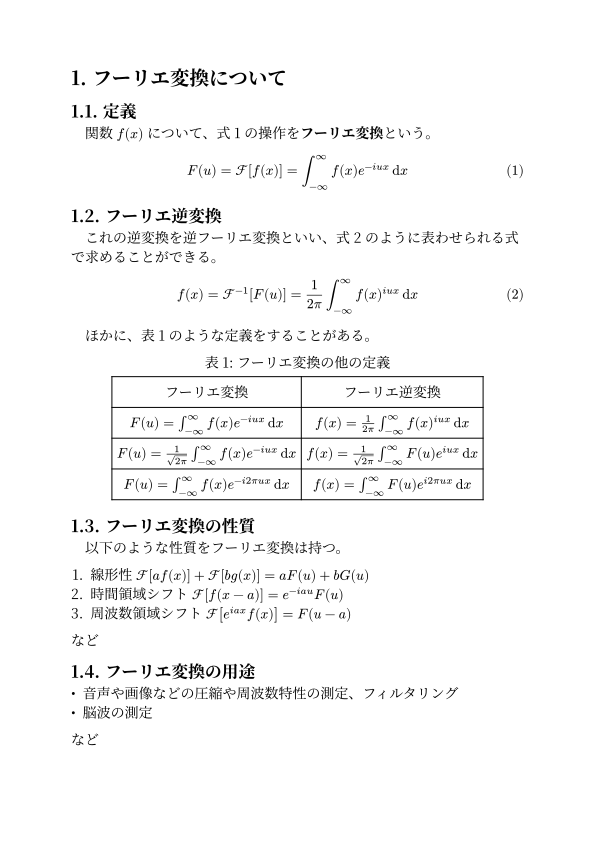
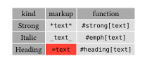
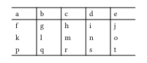
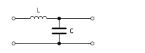
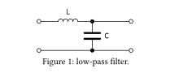
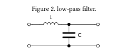

<script>
  MathJax = {
    tex: {
      inlineMath: [['$', '$']],
      displayMath: [['$$', '$$'], ["\\[", "\\]"]]
    }
  };
</script>
<script type="text/javascript" async
 src="https://cdn.jsdelivr.net/npm/mathjax@3/es5/tex-mml-chtml.js">
</script>


# 組版ソフト Typst の紹介

## はじめに
　この記事は群馬高専 [Advent Calendar 2024](https://adventar.org/calendars/10444) 22 日目の記事です。この記事では、Typst という $\TeX$ の代替となる組版ソフトを紹介したいと思います。 $\TeX$ とは、ドナルド・クヌース氏によって作成されたソフトウェアと、そのマークアップ言語のことを指します。

## 導入

　文書を作成するソフトウェアと聞いてまずはじめに思い浮かぶものといえば何があるでしょうか？　多くの人は Word や一太郎などのワープロソフトだと思います。これらワープロソフトでは、編集中の画面と出力結果がそのまま同じ表示になります。このような UI を WYSIWYG (**W**hat **Y**ou **S**ee **I**s **W**hat **Y**ou **G**ot) といいます。しかし、見た目では段落の見出しなどの構造と大きい文字などのデザインの区別がつけづらいという欠点があります。また、それぞれの機能を使用するために必要な操作の回数が多いことや、細かい調整が難しいなどの欠点もあります。

　これらの欠点は $\TeX$ を使用することで解決することができます。 $\TeX$ ではすべての文章、構造、デザインの設定などをテキストで記述します。そして、構造を正しく記述し、それに適したデザインを適用することで、統一感のある美しい文書を作成することができます。しかし、 $\TeX$ は WYSIWYG でない (コンパイルするまで結果がわからない) ことやコンパイルに時間がかかること、記述量が多いことという欠点があります。

　Typst は $\TeX$ よりも記述量が少なく、軽量な新しい組版ソフト・マークアップ言語です。オープンソースであり、ローカル、公式のウェブアプリ上でコンパイルすることができます。さらに、ウェブアプリや Visual Studio Code の拡張機能を使用することで出力結果を確認しながら編集できるため、WYSIWYG でもあります。しかし、新しいソフトウェアであるため日本語の情報が少ないことや、日本語へのローカライズが完璧ではないという欠点もあります。

## 使用

　Typst は、[ウェブアプリ (要ログイン) ](https://typst.app/)を使用するか、オフラインにインストールしたコンパイラを使用して文書を作成します。オフラインでコンパイルを行う場合、Visual Studio Code の拡張機能が便利です。Typst LSP と Typst Preview の二つの拡張機能を使用することでウェブアプリと同様の機能を使用できます。ただ、Typst Preview の拡張機能が廃止されているらしく、tinymist という後継の拡張機能を使用するようです (未確認) 。

## 記述例

　以下は Typst を使用して作成した文書です。かなりきれいにかけていると思います。



ソースコードは以下のようになります。

```typst
#set text(lang: "ja", font: "Harano Aji Mincho", size: 14pt)
#set heading(numbering: "1.1.")
#set math.equation(numbering: "(1)")
#show figure.where(kind: table): set figure.caption(position: top)

= フーリエ変換について
== 定義
　関数 $f(x)$ について、@eq:Fourier の操作を*フーリエ変換*という。

$ F(u) = cal(F)[f(x)] = integral^oo_(-oo) f(x) e^(-i u x) dif x $<eq:Fourier>
== フーリエ逆変換
　これの逆変換を逆フーリエ変換といい、@eq:rev_Fourier のように表わせられる式で求めることができる。
 
$ f(x) = cal(F)^(-1)[F(u)] = 1/(2 pi) integral^oo_(-oo) f(x)^(i u x) dif x $<eq:rev_Fourier>

　ほかに、@tbl:otherDefFourier のような定義をすることがある。

#figure(
  table(
    columns: 2,
    rows: 2.2em,
    align: center + horizon,
    "フーリエ変換", "フーリエ逆変換",
    $F(u) = integral^oo_(-oo) f(x) e^(-i u x) dif x$, 
    $f(x) =  1/(2 pi) integral^oo_(-oo) f(x)^(i u x) dif x$,
    $F(u) = 1/sqrt(2pi)integral^oo_(-oo) f(x) e^(-i u x) dif x$,
    $f(x) = 1/sqrt(2pi)integral^oo_(-oo) F(u) e^(i u x) dif x$,
    $F(u) = integral^oo_(-oo) f(x) e^(-i 2 pi u x) dif x$,
    $f(x) = integral^oo_(-oo) F(u) e^(i 2 pi u x) dif x$,
  ),
  caption: [フーリエ変換の他の定義]
)<tbl:otherDefFourier>

== フーリエ変換の性質
　以下のような性質をフーリエ変換は持つ。

+ 線形性 $cal(F)[a f(x)] + cal(F)[b g(x)] = a F(u) + b G(u)$
+ 時間領域シフト $cal(F)[f(x-a)] = e^(-i a u)F(u)$
+ 周波数領域シフト $cal(F)[e^(i a x)f(x)] = F(u-a)$
など

== フーリエ変換の用途

- 音声や画像などの圧縮や周波数特性の測定、フィルタリング
- 脳波の測定
など
```

　 $\TeX$ と比較して、特に数式や箇条書きのあたりの記述量が減ることがわかると思います。記述内容を上から見ていきます。

### テキストの設定
`#set text(lang: "ja", font: "Harano Aji Mincho", size: 14pt)`

　文章の設定をしています。言語を日本語 (指定しないと漢字が繁体字になる)、フォントを原ノ味明朝、フォントサイズを 14pt に設定しています。`#`以下は Code モードを表し、Typst のスクリプトを実行できます。`set text`はそれ以下の`text`関数に対してその引数を設定するというスクリプトです。`text`関数を明示的に呼んでいなくても、テキスト要素に適用されます。

### 見出しの設定
`#set heading(numbering: "1.1.")`

　見出しの番号付けの設定をしています。デフォルトでは番号付けがされません。このほかに、アルファベット順("a")、50音順("あ", "ア")、いろは順("い", "イ")などに対応しています (`=`は`heading`関数のマークアップ)。

### 数式の設定
`#set math.equation(numbering: "(1)")`

　見出しと同様です。`math.equation`で設定ができます。

### 表のキャプションの設定
`#show figure.where(kind: table): set figure.caption(position: top)`

　表のときのみキャプションが上にくるように設定しています (デフォルトでは下) 。スクリプトの意味としては、この行以下の`figure`関数のうち、引数`kind`が`table`のものに対して、`:`以下を適用しています。

### 見出し
`=`, `==`

　見出しになります。`=`を増やすことで、見出しを一段深くすることができます。`=`のあとにはスペースが必要です。

### 数式
`$ F(u) = cal(F)[f(x)] $`

　`$`マークで囲んだところは数式になります。`$sin x$`のように`$`マークに続けて書くとインライン形式に、`$ sin x $`のように空白を空けて書くとブロック形式になります。

### 参照
`$ sin x $<ref>`, `@ref`

　要素の後に続けて`<>` (不等号) で囲んだ文字列は、要素を指し示すラベルとなります。`@`ののちにラベルを書くことで、本文中などで参照を行うことができます。

### 強調
`*フーリエ変換*`

　`*`マークで囲まれた場所は太字による強調になります。`_`で囲むとイタリック体による強調になります。

### 表
`#figure(table())`

　`table`関数で表を書くことができます。引数の`columns: 2`, `rows: 2.2em`は行と列の設定、`align: center + horizon`は要素をセルのどこに配置するかを与えています。それより後は表のそれぞれの内容を示します。

　`figure`関数はキャプションと図表番号のカウンタを提供します。カウンタは図表を増やすごとにそれぞれカウントされていき、`caption: "例1"`のようにキャプションをつけることで、キャプションの先頭に番号が付加されます。`table`関数のほかに、`image`関数や`raw`関数 (生テキスト) などで使用できます。

### リスト
`-`, `+`

　行頭に`-`を置くことでリスト (箇条書き) を、`+`を置くことで番号付きリストを作成できます。インデントをすることで入れ子構造にすることが可能です。

## さいごに

　今回は新しい組版ソフト Typst について紹介しました。まだ使用者が少なく、日本語の情報があまりないのですが、Google 検索で「typst 数式」などと、やりたいことを調べれば、情報が出てくると思います。この記事をきっかけで Typst で文書を書く人が増えてくれればうれしいです。

## 参考文献

1. Typst Documentation [https://typst.app/docs](https://typst.app/docs)

2. 話題の組版エンジン Typst を触ってみた [https://zenn.dev/monaqa/articles/2023-04-19-typst-introduction](https://zenn.dev/monaqa/articles/2023-04-19-typst-introduction)

3. やりたいことから始めるTypst [https://qiita.com/tomoyatajika/items/649884befe95c5f1dcea](https://qiita.com/tomoyatajika/items/649884befe95c5f1dcea)

4. Typst における高校数学テンプレート [https://www.metaphysica.info/2024/typst-template/](https://www.metaphysica.info/2024/typst-template/)

閲覧 2024-12-10 から 2024-12-18

## 補足とか

　本文中に書くことでもないので最後に書きます。始めたときよくわからなかったことや使うときに最低限必要な知識などを書いてます。

### モード

　Typst には、コードモード、数式モード、マークアップモードの3つのモードがあります。

+ マークアップモード

    コード、数式モードのいずれでもない場所、もしくは明示的に`[]`で囲まれた場所で、Typstのマークアップにより書かれた文書を描画します。マークアップを使用することで関数を呼び出さなくても文書の装飾を行うことができます。関数の後に`[]`を使用することで、関数にその中身を渡すこともできます。

+ コードモード

    `#`から始まるブロックで、Typst のスクリプトを実行します。関数などが用意されており、また、`let`を使用することで自ら定義することもできます。また、条件分岐`if`や繰り返し`for`, `while`なども使用することができます。[ドキュメント](https://typst.app/docs/reference/syntax/#code)に構文一覧が載っています。

+ 数式モード

    `$`で囲まれたブロックで、数式を描画します。`$f(x)$`のように空白を入れずに記述するとインライン形式、`$ f(x) $`のように前後に空白を入れて記述するとブロック形式になります。数式モードで使える記号は[ドキュメント](https://typst.app/docs/reference/symbols/sym/)にのっています。また、$\rightarrow$ が`->`と書けるなど、略記も使用できます。


### マークアップ

　マークアップモードで使用できるマークアップとして以下があります (一部抜粋)。詳しくは[ドキュメント](https://typst.app/docs/reference/syntax/#markup)で確認してください。

| 種類 | マークアップ | 関数 |
| - | - | - |
| 強調（太字） | `*text*` | `#strong[text]` |
| 強調（斜体） | `_text_` | `#emph[text]` |
| 生テキスト | `` `text` `` | `#raw[text]` |
| 見出し | `= text` | `#heading[text]` |
| リスト | `- text` | `#list[text]` |
| 番号付きリスト | `+ text` | `#enum[text]` |
| 用語リスト | `/ term: text` | `#terms(([term], [text]))` |
| ラベル | `<label>` | `#label("text")` |
| 参照 | `@label` | `#ref(<label>)` |
| 行送り | `\ `（`\`の後に改行か空白） | `#linebreak()` |
| 段落送り | 改行2回 | `#parbreak()` |
| コメント | `/* comment */`, `// comment ` | none |

### 数式モード

　`$`で囲まれたブロックで、数式を描画します。`$f(x)$`のように空白を入れずに記述するとインライン形式、`$ f(x) $`のように前後に空白を入れて記述するとブロック形式になります。数式モードで使える記号は[ドキュメント](https://typst.app/docs/reference/symbols/sym/)にのっています。また、$\rightarrow$ が`->`と書けるなど、略記も使用できます ([モード](#モード))。

　数式モード中では単一の文字はそのまま表示されます。文字列になると、それは変数または関数と解釈されます。引用符で囲むとそのまま表示できます。数式内で改行を行うためには`\ `を置きます。また、同じ数の`&`を異なる行に置くことで、その位置をそろえることができます。

[ドキュメント](https://typst.app/docs/reference/math/)

### 括弧について

　角括弧`[]`はマークアップモード、波括弧`{}`はコードモードのブロック、不等号の括弧`<>`はラベル、丸括弧`()`は関数の引数、配列、辞書など様々に使用されます。数式モードの中では、括弧の大きさは自動で調整されます。

### set rules

　set rules を用いることで、関数や要素のデフォルトをカスタマイズすることができます ([記述例を参照](#テキストの設定))。テキストや見出し、数式、ページ、リストなど様々なものに作用させることができます。トップレベルで記述されている場合はファイルの最後まで、ブロック内で記述されている場合はそのブロックが終了するまで有効となります。

```typst
#set text(fill: red)
This text is filled in red.
```


### show rules

　基本的な形式は、show-set rules で、`show`, セレクタ, コロン, set rules の順に記述します。これにより、セレクタに合致する部分に set rules を適用できます。セレクタに使用できるものは、標準の関数、文字列、正規表現、ラベルなどです。また、関数を特定の引数を持つものにフィルタして適用することもできます ([記述例も参照](#表のキャプションの設定))。

```typst
#show heading.where(level: 2): set text(fill: blue)
= Level 1
== Level 2
=== Level 3
```


　show rules には、セレクタに一致した部分を任意の関数に置き換えることもできます。この場合、コロンの後の set rules を任意の関数に置き換えます。

```typst
#show heading : it => {
  set text(font: "Noto Sans")
  underline(it)
}
= heading
#lorem(5)
```


　show rules で注意する点として、セレクタとして使用できる関数が標準のもののみということがあります。このため、自ら定義した関数やライブラリの関数などは使用できません。

### 文章 Text

　使いそうな設定を列挙。

- 言語\
  `#set text(lang: "ja")`

- テキストサイズ\
	`#set text(size: 10.5pt)`

- 文字色\
	`#set text(fill: blue)`

- フォント\
	`#set text(font: "Harano Aji Mincho")`

- スラッシュゼロ\
	`#set text(slashed-zero: true)`

- 太さ\
	`#set text(weight: "medium")`

[ドキュメント](https://typst.app/docs/reference/text/text/)

### ページ Page

　使いそうな設定を列挙。

- 用紙\
	`#set page(paper: "a4")`

- 幅 (用紙に優先される)\
	`#set page(width: 200pt)`

- 高さ (用紙に優先される)\
	`#set page(height: 200pt)`

- 用紙の向き\
	`#set page(flipped: true)`

- 余白\
	`#set page(margin: (x: 3cm, y: 4cm))`

- 列数\
	`#set page(columns: 2)`

- 背景色\
	`#set page(fill: blue)`

- ページ番号\
	`#set page(numbering: "1 / 1")`\
	`#set page(number-align: right)`

- ヘッダ\
	`#set page(header: [#h(1fr)abc])`
	h関数は引数の長さの空きです。

- フッタ\
	`#set page(footer: [abc])`

[ドキュメント](https://typst.app/docs/reference/layout/page/)

### 段落 Paragraph

　使いそうな設定を列挙。

- 行間\
	`#set par(leading: 1em)`

- 段落間間隔\
	`#set par(spacing: 3em)`

- 段落最初の行のインデント
	`#set par(first-line-indent: 1em)`
	一番初めの段落は英語圏の慣習によりインデントされないため注意。

[ドキュメント](https://typst.app/docs/reference/model/par/)

### 表 Table

　`table`関数で表の記述ができます。

```typst
#table(
  columns: (auto,)*2 + (1fr,),
  align: center,
  fill: (x, y) => {
    if y==0 or x==0{gray}
    else {silver}
  },
  stroke: white,
  [kind], [markup], [function],
  [Strong], [`*text*`], [`#strong[text]`],
  [Italic], [`_text_`], [`#emph[text]`],
  [Heading], table.cell(fill: red)[`=text`], [`#heading[text]`]
)
```



　`columns`は行の指定で列数で指定することもできますが、配列で指定することもできます。配列で指定する場合、上記のように長さをとる配列を使用します。`rows`も同様に列の指定をします。`align`はセル内の要素の配置を指定します。`fill`は塗りつぶしの色などを指定できます。`stroke`は罫線の設定で、罫線の有無や色、太さを指定できます。それ以下が表本体の要素です。`table.cell`はセル単位でのこれらの設定と、セルの結合などができます。

　表を作成するとき、罫線の形式を決めたいことがあると思います。私が所属する J 科では横罫線はヘッダ行と一番下の行、縦罫線は端以外を表示というルールがあります。このような場合は`set`で`stroke`を設定します。

```typst
#set table(stroke: (x, y) => (
    top: if(1 < y) {0pt} else {1pt},
    left: if(0 < x) {1pt},
    bottom: {1pt}
  )
)
#table(
  columns: (1fr,)*5,
  [a], [b], [c], [d], [e],
  [f], [g], [h], [i], [j],
  [k], [l], [m], [n], [o],
  [p], [q], [r], [s], [t],
)
```



[ドキュメント](https://typst.app/docs/reference/model/table/)

### 画像 Image

　画像を読み込みたいときは`image`関数を使用します。対応している形式は png, jpeg, gif, svg です。

```typst
#image(
  "WRC_LC.svg",
  alt: "Circuit diagram of a low-pass filter.",
  width: 120pt
)
```



[ドキュメント](https://typst.app/docs/reference/visualize/image/)

### 図表 (キャプションはここ) Figure

　キャプションを書くには、`table`関数や`image`関数を`figure`関数の引数にします。

```typst
#figure(
  image(
    "WRC_LC.svg",
    alt: "Circuit diagram of a low-pass filter.",
    width: 120pt
  ),
  caption: [low-pass filter.]
)
```



　"Figure 1:" が英語ですが、言語を日本語に設定することで "図1:" のようになります。番号の前に付加する図、表などの文字列を変更したい場合は引数`supplement`を変更します。番号とキャプションを分ける文字列を変更したい場合は`#set figure.caption(separator: ". ")`の設定をします。

　キャプションの位置を変更するためには、`figure`関数の`align`引数を設定します。以下のようにすることで画像のキャプションの位置を変更できます。

```typst
#show figure.where(
  kind: image
): set figure.caption(position: top) 

#set figure.caption(separator: ". ")

#figure(
  image(
    "WRC_LC.svg",
    alt: "Circuit diagram of a low-pass filter.",
    width: 120pt
  ),
  caption: [low-pass filter.]
)
```



[ドキュメント](https://typst.app/docs/reference/model/figure/)

### 参考文献

　.bib ファイルが使用可能です。
```typst
#bibliography("works.bib")
```
　ほかに、新しく設計された Hayagriva (YAML ファイル) を使用することもできます。

```YAML
labelBook:
  type: Book
  title: Title
  author: Author Name
  publisher: Publisher Name
  edition: "1"
  date: 2022-09-10
  serial-number: 
    isbn: "ISBNAAA-B-CCC-DDDDD-E"

labelWeb:
  type: Web
  title: "Example Domain"
  author: IANA
  url: 
    value: "https://example.com"
    date: 2024-12-21
```

```typst
#lorem(5)@labelBook

https://example.com is for use in illustrative examples in documents.@labelWeb

#bibliography("bibliography.yml")
```

![上から本文で "Lorem ipsum dolor sit amet.[1]", "https://example.com is for use in illustrative examples in documents.[2]", 見出しで "Bibliography", 本文で "[1] Author Name, Title, 1st ed. Publisher Name, 2022.", "[2] IANA, “Example Domain.” Accessed: Dec. 21, 2024. [Online]. Available: https://example.com/"](bib.svg)

　設定が日本語の場合は日本語用の設定がされます。`style`引数でどのような参考文献のスタイルにするかを設定できます。本文中に参照されていない場合、表示されないので注意してください。


[ドキュメント](https://typst.app/docs/reference/model/bibliography/)\
[Hayagriva](https://github.com/typst/hayagriva/blob/main/docs/file-format.md)


### インライン数式の前後に空白を入れる

```typst
#show math.equation.where(block: false): it => {
  h(0.25em) + it + h(0.25em)
}
```


　テキストは自動で欧文-和文間に四分空きが入るのですが、数式は入らないので自動で入るようにする設定です。ただ、句読点などに数式が続くときにも入るようになるため、手動で調整が必要かもしれません。

### 数式、生テキストのフォント変更

```typst
#show math.equation: set text(font: "Lete Sans Math")
```

```typst
#show raw: set text(font: "Source Code Pro")
```
### リストのページによる分割の設定

```typst
#show figure.where(kind: raw): set block(breakable: true)
```
